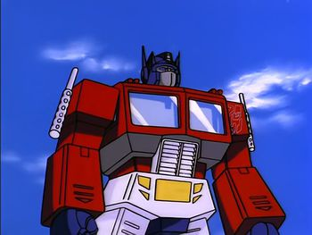

# Building a Generative Pre-trained Transformer (GPT)

## About

In this notebook we implement a decoder only Transformer, which can be trained for character level prediction. The network has a self-attention and fully connected layer. It doesn't implement the cross-attention. The original paper implements the model for language translation, therefore it has a decoder and encoder.

Most of the code was presented in [1], most of the theoretical background was presented in [2], [3], [4], [5]. Figures are taken from the "Attention is all you need paper" [6]. 

Notebook author: *Matjaž Zupančič*

## References:

[1] https://www.youtube.com/watch?v=kCc8FmEb1nY&t=8s&ab_channel=AndrejKarpathy

[2] https://www.youtube.com/watch?v=yGTUuEx3GkA&ab_channel=Rasa

[3] https://www.youtube.com/watch?v=tIvKXrEDMhk&ab_channel=Rasa

[4] https://www.youtube.com/watch?v=23XUv0T9L5c&ab_channel=Rasa

[5] https://www.youtube.com/watch?v=EXNBy8G43MM&ab_channel=Rasa

[6] https://arxiv.org/abs/1706.03762
