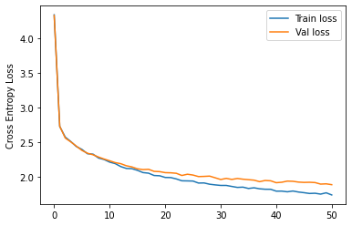

# Building a Generative Pre-trained Transformer (GPT)


## About

In this notebook, we aim to bridge the gap between theory and practical implementation by implementing a decoder-only Transformer model for character-level prediction. The majority of the code used in this project has been sourced from [1], while the theoretical insights have been taken from various sources including [2], [3], [4], [5]. Additionally, illustrations used in this notebook are taken from the "Attention is all you need" paper [6].

Notebook: [Generative Pre-trained Transformer](./GPT.ipynb)

## Results

We train the model to predict the next character on the tinyshakespear dataset [7], the following figure shows the Cross Entropy Loss
after 5000 epochs (the model was trained for roughly 5 minutes on google colab). The text bellow shows characters generated by the trained model.




```
Be everablel that him lost to betchself,
Are I Gracouse are as to give, but the even
die rectunglients senook a well the laie olm prine!
Let am fore sore of has sife togling death!
Bother faster oftement young of leaven lest plent:
3'tere that you goent theen sadady:
Whe man unter some son, done, what
On here comain no appoous in his sonn.

Clivelime, knowns may my plent grant. Seeve,
If grass parinot fighter'd, none I he litce a't this wook,
Is deecoyd trown weechlls fore teems
And queecess for fine. 'I blanives hass to a swity?

JATHAST:
Anand, good, tand.

LARADY VIAver:
Nay not haring, I wast gadle to gator:
So see they harm, or me some
erry I knows long fith and goth me weareing on cloil? mance, themm it with,
his you your beark wesks condemiss!
Plancenity the is bollr, butch an't
him tant woen no cleguaters a knowly the preadying guitine. I kneepp; my Godves'd.
Yet you havan with to prity; let dene! the that be crince your kneep to your fight teltised, breconsess him
To worl is thronest; wenemen, frad,
Butwell these he, whending whith to incon bees!
That thoughs: at cause: and yeare willife;
Friess whose? stren? your clappess,
Bery his I'll have o'en tees, here'll meln
Which is alainstent. Henck:
There, whom of that you whater cachare hus ancises,
Thats and be the with the here to strends! any mever it worth.

DoOLAND:
Plepatestrons? There Wall not I grerah in face.

My love My dated, no planesences,
He anathous polp wodch a carcastinx His nigh then?
Sarnish, Stance thall not hend malkingnat fellows.

LUCEN:
I wasgad a devenith thell, and of the!
ste stampes, you mady of meacks'
Alass never greats lasighters to drience.
What kneep tody ply, and resary.

PEALELBY:Shechy yon sould! How owne,
The will goity hill strone of ge.
Panit sinderted tenest thesbing recondom with,
What till son freegunce!
Here him daynced, eyes rans contity
With on those anttend, whyse his loe this counse these ancine, set:
To Richil thus with him wricknesss,
I'll sove down, in they dist
```

## References:

[1] https://www.youtube.com/watch?v=kCc8FmEb1nY&t=8s&ab_channel=AndrejKarpathy

[2] https://www.youtube.com/watch?v=yGTUuEx3GkA&ab_channel=Rasa

[3] https://www.youtube.com/watch?v=tIvKXrEDMhk&ab_channel=Rasa

[4] https://www.youtube.com/watch?v=23XUv0T9L5c&ab_channel=Rasa

[5] https://www.youtube.com/watch?v=EXNBy8G43MM&ab_channel=Rasa

[6] https://arxiv.org/abs/1706.03762

[7] https://raw.githubusercontent.com/karpathy/char-rnn/master/data/tinyshakespeare/input.txt
